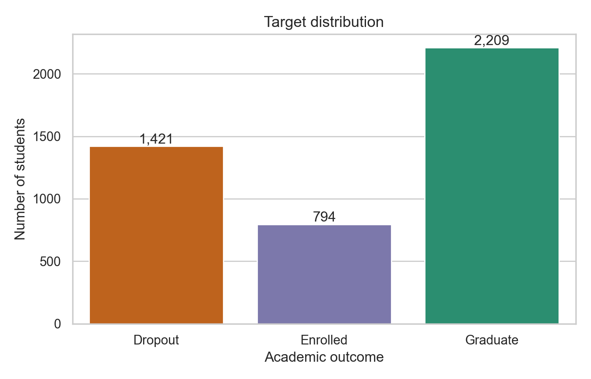
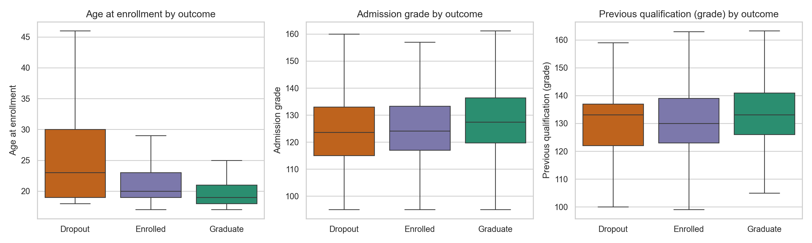
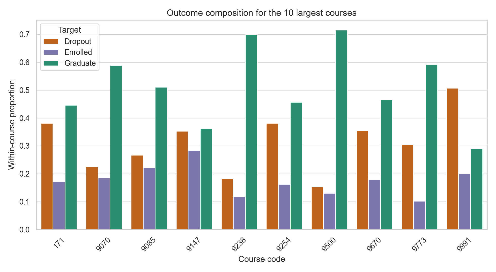
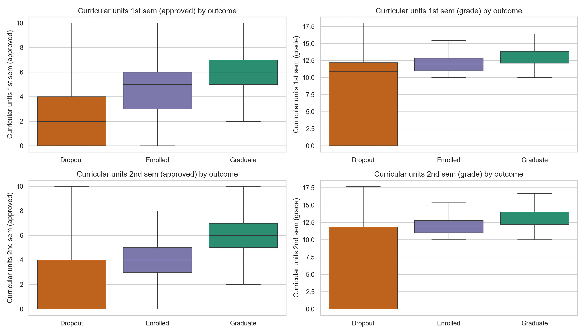
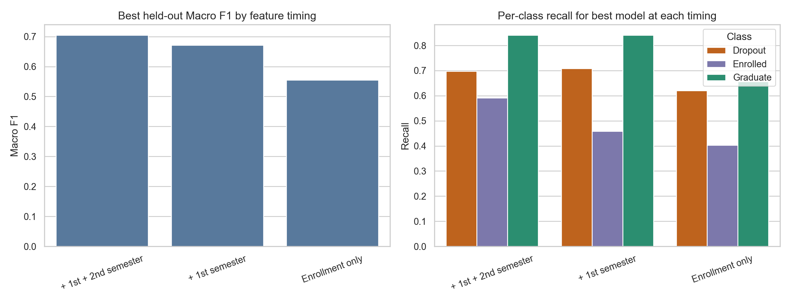
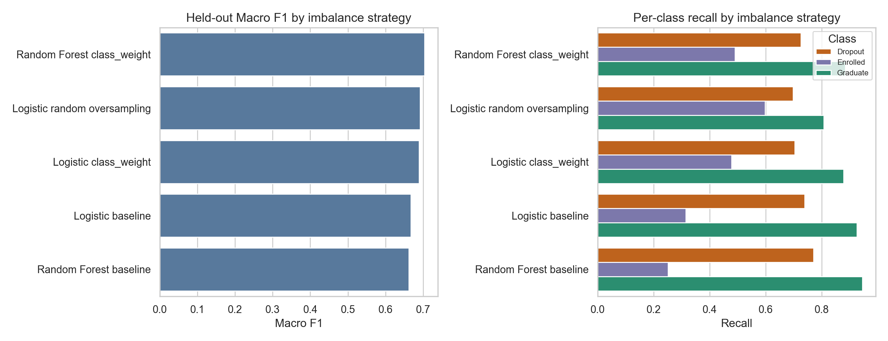
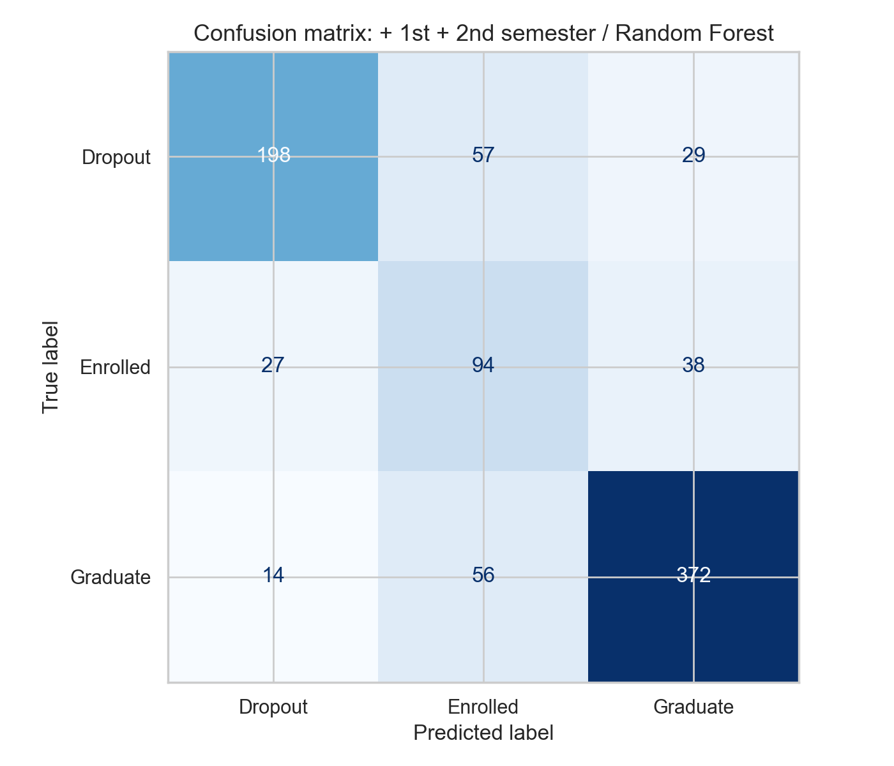
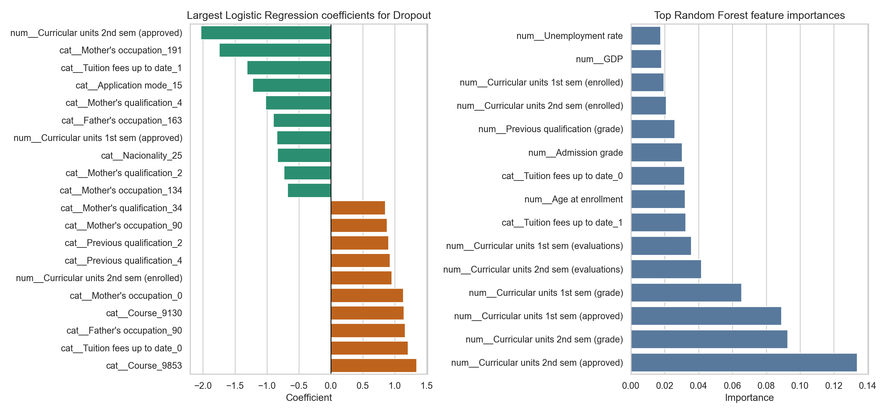

# 基于机器学习的学生退学与学业成功预测研究

## 摘要

学生退学预测是高等教育数据科学中的一个重要应用场景。及时识别存在退学风险或学业进展困难的学生，有助于学校更早提供学业辅导、经济支持和个性化干预。本研究使用 UCI Machine Learning Repository 中的 *Predict Students' Dropout and Academic Success* 数据集，构建并比较多种机器学习分类模型，用于预测学生最终学业状态：`Dropout`、`Enrolled` 和 `Graduate`。

本研究的核心设计是“预测时间点”比较。第一组模型仅使用入学时可获得的信息，例如申请方式、课程、年龄、入学成绩、学费状态和社会经济指标；第二组模型在此基础上加入第一学期学业表现；第三组模型进一步加入第二学期学业表现。该设计能够区分真实早期预警场景与学期表现已知后的风险识别场景，避免将未来信息误用于入学阶段预测。

实验比较了 DummyClassifier、Logistic Regression、Decision Tree、KNN、SVM、Random Forest、XGBoost 和 MLP 等模型，并使用 Accuracy、Macro F1、Weighted F1 以及各类别 recall 进行评估。由于目标类别分布不均衡，本文以 Macro F1 作为主要评价指标，并重点关注 `Dropout` 类别召回率。结果显示，仅使用入学信息时最佳模型 Macro F1 为 0.555；加入第一学期信息后提升至 0.671；加入第一和第二学期信息后，Random Forest 获得最佳 Macro F1，Accuracy 为 0.750，Macro F1 为 0.705，`Dropout` recall 为 0.697。原始 XGBoost 在完整特征集上获得更高 accuracy（0.767），但 Macro F1 为 0.698，略低于 Random Forest；进一步以 Macro F1 为目标调参后，XGBoost 的 `Enrolled` recall 从 0.428 提升到 0.642，但整体 Macro F1 为 0.700，仍略低于 Random Forest。结果表明，早期学业表现对最终学业状态预测具有明显价值，但模型在真实部署时必须严格匹配可用信息的时间点。

**关键词：** 学生退学预测；机器学习；多分类；类别不平衡；早期预警；特征时间点

## 1. 引言

高等教育中的学生退学问题会同时影响学生个人发展、学校资源配置和教学质量管理。对于学生而言，退学可能意味着学业路径中断、经济投入损失和长期职业机会受限；对于学校而言，退学率也会影响教学支持体系、课程设计和学生服务策略。因此，如果能够在学生出现严重学业困难之前识别潜在风险，学校就有机会采取更及时的干预措施。

机器学习为这一问题提供了一种可操作的方法。通过历史学生数据，模型可以学习入学背景、课程选择、成绩表现和社会经济变量与最终学业结果之间的关联。然而，学生退学预测并不是一个单纯追求高准确率的问题。首先，目标类别存在不平衡：毕业学生通常多于仍在读或退学学生。其次，真实世界中的模型部署受到时间限制。入学时可以使用的变量，与第一或第二学期结束后可以使用的变量并不相同。如果模型在入学阶段使用了未来学期成绩，即使测试集指标很高，也无法成为一个现实可用的早期预警系统。

因此，本文不仅比较不同模型的性能，还重点研究不同预测时间点下信息量增加对模型效果的影响。本文的研究问题如下：

1. 机器学习模型能否有效预测学生最终是退学、仍在读还是毕业？
2. 与仅使用入学信息相比，加入第一学期和第二学期学业表现能否提升预测效果？
3. 类别不平衡处理是否能够改善少数类或干预相关类别的识别能力？
4. 哪些变量对退学风险和学业成功预测具有较强解释价值？

## 2. 数据集与任务定义

本研究使用的数据集来自 UCI Machine Learning Repository，名称为 *Predict Students' Dropout and Academic Success*。数据集包含 4424 名高等教育学生记录，每条记录包含 36 个特征和 1 个目标变量。目标变量 `Target` 是三分类结果：

| 类别 | 含义 | 样本数 | 占比 |
|---|---:|---:|---:|
| `Graduate` | 已毕业 | 2209 | 49.93% |
| `Dropout` | 退学 | 1421 | 32.12% |
| `Enrolled` | 仍在读 | 794 | 17.95% |

数据集中没有缺失值，也没有重复记录。由于 `Graduate` 接近一半，而 `Enrolled` 不到五分之一，数据存在明显类别不平衡。如果只使用 accuracy，模型可能偏向预测多数类，从而掩盖对少数类的识别不足。因此本文使用 Macro F1 作为主要指标，同时报告 accuracy、weighted F1 和每个类别的 recall。

本任务被定义为监督学习中的多分类问题。输入为学生的入学背景、课程、社会经济信息和学期表现变量，输出为学生最终学业状态。与二分类退学预测相比，三分类设置更接近原始数据集，也能区分“仍在读”和“已毕业”这两种非退学状态。

## 3. 特征时间点设计

本研究最重要的方法设计是将特征按照现实可用时间点分组。数据集中既包含入学时已知变量，也包含第一和第二学期之后才可能获得的学业表现变量。如果不加区分地使用所有变量，模型可能获得较高性能，但这种结果不能代表入学时早期预警能力。

本文构建了三个特征集合：

| 特征集合 | 特征数 | 现实含义 |
|---|---:|---|
| Enrollment only | 24 | 入学时即可获得的信息 |
| + 1st semester | 30 | 入学信息加第一学期表现 |
| + 1st + 2nd semester | 36 | 入学信息加第一、第二学期表现 |

Enrollment-only 特征包括婚姻状态、申请方式、申请志愿顺序、课程、上课时段、先前学历及成绩、父母教育与职业、入学成绩、是否异地、是否有特殊教育需求、是否欠费、学费是否按时缴纳、性别、是否获得奖学金、入学年龄、是否国际学生以及宏观经济指标等。

第一和第二学期变量主要描述课程注册、评估、通过数量、成绩和未评估课程数量。这些变量与最终结果有更直接的关系，但它们只有在对应学期结束后才能被使用。因此，本文将它们作为不同预测时点的增量信息，而不是直接混入入学阶段模型。

## 4. 探索性数据分析

### 4.1 目标类别分布

目标变量分布显示，`Graduate` 是最大类别，`Dropout` 次之，`Enrolled` 最少。这说明模型评价不能只依赖 accuracy。一个始终预测 `Graduate` 的多数类基线模型可以获得接近 0.499 的 accuracy，但 Macro F1 只有 0.222，并且对 `Dropout` 和 `Enrolled` 的 recall 均为 0。

### 4.2 入学变量与学业结果

入学年龄、入学成绩和先前学历成绩等变量在不同目标类别之间存在一定差异。直观上，毕业学生通常拥有更稳定的学业表现背景，而退学学生在部分入学指标上可能相对弱一些。不过，仅凭入学信息预测最终结果仍然较难，因为学生进入大学后的表现会受到课程适应、经济压力和个人状态变化等多种因素影响。

课程变量也与最终结果存在关联。不同课程的退学、仍在读和毕业比例并不完全相同，这可能反映课程难度、专业吸引力、学生选择偏好或资源支持差异。但这些观察属于预测关联，不能直接解释为课程本身导致退学。

### 4.3 学期表现与学业结果

第一和第二学期的通过课程数量、课程成绩和评估数量与最终学业状态关系更明显。总体而言，毕业学生通常拥有更多通过课程数和更高学期成绩，而退学学生在这些变量上表现较弱。这也解释了为什么加入学期表现后模型性能明显提升。

需要注意的是，这些变量虽然预测能力强，但并不适合入学时预测。如果目标是在第一学期结束后识别风险学生，那么第一学期成绩可以使用；如果目标是在学生刚入学时进行预警，则必须排除这些未来变量。

## 5. 方法

### 5.1 数据划分与预处理

本文使用分层训练/测试划分，训练集包含 3539 条记录，测试集包含 885 条记录。分层划分保证训练集和测试集中的目标类别比例基本一致。所有模型在相同划分下进行比较。

预处理使用 pipeline 完成，以避免训练集和测试集之间的信息泄漏。行政编码类变量被视为类别变量，并使用 one-hot encoding；成绩、年龄、经济指标、申请顺序和课程单元数量等变量被视为数值变量，并进行标准化。将预处理和模型封装在同一 pipeline 中，可以确保交叉验证过程中每一折都只基于训练折拟合预处理步骤。

### 5.2 模型选择

本文比较以下模型：

| 模型 | 选择原因 |
|---|---|
| DummyClassifier | 多数类基线，用于判断模型是否真正学习到有效模式 |
| Logistic Regression | 可解释的线性模型，可观察类别系数 |
| Decision Tree | 简单非线性模型，易于理解 |
| KNN | 基于样本距离的分类方法 |
| SVM (RBF) | 能处理非线性边界的间隔分类器 |
| Random Forest | 集成树模型，通常对表格数据表现稳定 |
| XGBoost | 梯度提升树模型，常用于结构化表格数据 |
| MLP | 简单神经网络模型，用于比较非线性学习能力 |

每个模型均通过 `GridSearchCV` 在训练集上进行小范围超参数搜索。交叉验证采用 stratified 5-fold，并以 Macro F1 作为 `refit` 指标。这一选择与任务目标一致，因为 Macro F1 会平等看待三个类别，不会让多数类 `Graduate` 主导模型选择。

### 5.3 评价指标

本文报告四类指标：

| 指标 | 作用 |
|---|---|
| Accuracy | 整体预测正确率，便于直观理解 |
| Macro F1 | 三个类别 F1 的平均值，是本文主要指标 |
| Weighted F1 | 按类别样本量加权的 F1，反映整体表现 |
| Per-class recall | 检查模型对 `Dropout`、`Enrolled` 和 `Graduate` 的识别能力 |

在退学预警场景中，`Dropout` recall 尤其重要。若模型漏掉大量实际退学学生，即使整体 accuracy 较高，也难以支持有效干预。

## 6. 实验结果

### 6.1 不同特征时间点的最佳模型

三个特征集合下的最佳模型结果如下：

| 特征集合 | 最佳模型 | Accuracy | Macro F1 | Weighted F1 | Dropout Recall | Enrolled Recall | Graduate Recall |
|---|---|---:|---:|---:|---:|---:|---:|
| Enrollment only | Random Forest | 0.599 | 0.555 | 0.606 | 0.620 | 0.403 | 0.656 |
| + 1st semester | Logistic Regression | 0.730 | 0.671 | 0.731 | 0.708 | 0.459 | 0.842 |
| + 1st + 2nd semester | Random Forest | 0.750 | 0.705 | 0.757 | 0.697 | 0.591 | 0.842 |

结果显示，加入第一学期表现后，Macro F1 从 0.555 提升到 0.671，提升幅度明显。进一步加入第二学期表现后，Macro F1 提升到 0.705，并且 `Enrolled` recall 从 0.459 提升到 0.591。这说明早期学业表现变量为模型提供了大量有用信息，尤其有助于区分仍在读学生与其他类别。

从实际应用角度看，Enrollment-only 模型虽然性能最低，但它代表最早可部署的预警系统；加入第一学期后的模型更适合第一学期结束后的干预；加入第二学期后的模型则更接近中后期学业状态识别。三者不是简单的优劣关系，而是对应不同现实使用场景。

### 6.2 全部模型比较

在包含第一和第二学期特征时，Random Forest 的 Macro F1 表现最好，测试集 Macro F1 为 0.705；原始 XGBoost 的 accuracy 最高，为 0.767，但 Macro F1 为 0.698，略低于 Random Forest；SVM (RBF) 的 Macro F1 为 0.692；Logistic Regression 为 0.680。XGBoost 的初始结果说明，更高的整体正确率并不一定意味着更好的类别均衡表现，因为它对 `Graduate` 类别 recall 较高，但对 `Enrolled` 类别 recall 较低。

为进一步检查 XGBoost 是否可以通过调参改善少数类识别，本文在最丰富特征集合上进行了 focused tuning。搜索范围包括 `max_depth`、`learning_rate`、`min_child_weight`、`subsample`、`colsample_bytree`、`reg_alpha`、`reg_lambda` 和 balanced sample weight。最佳 tuned XGBoost 使用 balanced sample weight、`n_estimators=350`、`max_depth=4`、`learning_rate=0.05`、`min_child_weight=5`、`reg_lambda=5.0` 和 `reg_alpha=0.1`。调参后，XGBoost 的 `Enrolled` recall 从 0.428 提升到 0.642，说明类别权重和正则化确实改善了少数类识别；但其 accuracy 降至 0.739，Macro F1 为 0.700，仍略低于 Random Forest 的 0.705。因此，若研究目标优先考虑类别均衡，Random Forest 仍是本文的最佳主模型；若特别关注 `Enrolled` 识别，tuned XGBoost 可作为有价值的备选模型。

对于只加入第一学期特征的模型，Logistic Regression 表现最好，Macro F1 为 0.671。仅使用入学信息时，Random Forest、SVM、Logistic Regression 和 XGBoost 的 Macro F1 接近，但都明显低于加入学期表现后的模型。

多数类基线模型的 accuracy 为 0.499，但 Macro F1 只有 0.222，且完全无法识别 `Dropout` 和 `Enrolled`。这说明本研究中的机器学习模型确实超越了简单多数类预测，也说明 Macro F1 对本任务更有解释力。

### 6.3 类别不平衡处理

本文进一步在最丰富的特征集合上比较了类别不平衡处理策略。结果如下：

| 实验 | CV Macro F1 | Accuracy | Macro F1 | Dropout Recall | Enrolled Recall | Graduate Recall |
|---|---:|---:|---:|---:|---:|---:|
| Random Forest class_weight | 0.710 | 0.763 | 0.704 | 0.725 | 0.491 | 0.885 |
| Logistic random oversampling | 0.702 | 0.734 | 0.692 | 0.697 | 0.597 | 0.808 |
| Logistic class_weight | 0.704 | 0.750 | 0.689 | 0.704 | 0.478 | 0.878 |
| Logistic baseline | 0.690 | 0.756 | 0.667 | 0.739 | 0.314 | 0.925 |
| Random Forest baseline | 0.666 | 0.765 | 0.663 | 0.771 | 0.252 | 0.946 |

Random Forest with class_weight 获得最高的交叉验证 Macro F1 和较好的测试集 Macro F1，同时将 `Dropout` recall 提升到 0.725。Logistic random oversampling 对 `Enrolled` recall 改善最明显，达到 0.597，但整体 accuracy 较低。这个结果说明，不平衡处理并不一定让所有指标同时提高，它通常会改变不同类别之间的错误分配。

在实际学生支持场景中，模型选择应结合干预成本。如果学校希望尽可能少漏掉退学风险学生，可以接受更多误报，那么应更重视 `Dropout` recall；如果干预资源有限，则需要在 recall 和 precision 之间取得平衡。

### 6.4 最佳模型诊断

以测试集 Macro F1 作为主要标准，最佳模型为使用全部特征的 Random Forest。其分类报告如下：

| 类别 | Precision | Recall | F1-score | Support |
|---|---:|---:|---:|---:|
| Dropout | 0.83 | 0.70 | 0.76 | 284 |
| Enrolled | 0.45 | 0.59 | 0.51 | 159 |
| Graduate | 0.85 | 0.84 | 0.84 | 442 |
| Accuracy |  |  | 0.75 | 885 |
| Macro avg | 0.71 | 0.71 | 0.71 | 885 |
| Weighted avg | 0.77 | 0.75 | 0.76 | 885 |

该模型对 `Graduate` 的识别最稳定，对 `Dropout` 也具有较好的 precision 和 recall。但 `Enrolled` 类别仍然最难预测，precision 只有 0.45。这可能是因为“仍在读”本身是一个过渡状态，它与最终毕业或退学之间存在较多重叠。部分仍在读学生可能在未来毕业，也可能之后退学，因此该类别边界比 `Graduate` 和 `Dropout` 更模糊。

## 7. 特征解释

本文使用两种方式观察模型解释性：Logistic Regression 中 `Dropout` 类别的系数，以及 Random Forest 的 feature importance。需要强调的是，这些结果表示预测关联，而不是因果关系。

在 Logistic Regression 中，与 `Dropout` 预测最相关的变量包括第二学期通过课程数量、学费是否按时缴纳、部分课程类别、申请方式、父母职业和第一学期通过课程数量等。其中，第二学期通过课程数量的系数为负，说明通过课程越多，模型越不倾向于预测为退学；学费未按时缴纳与退学预测呈正向关联。

Random Forest 的重要性结果也显示，第二学期通过课程数量、第二学期成绩、第一学期通过课程数量和第一学期成绩是最重要的变量。入学年龄、入学成绩、先前学历成绩、GDP、失业率、通货膨胀率、奖学金状态和欠费状态也进入重要变量列表。

这些结果与教育场景直觉一致：学生早期课程通过情况和成绩越好，最终毕业概率越高；学费状态、奖学金和年龄等变量可能反映经济压力、学习条件或学生群体差异。不过，在实际应用中，人口统计和社会经济变量必须谨慎使用，因为它们可能引入公平性和伦理风险。

## 8. 讨论

### 8.1 预测时间点的重要性

本研究最重要的发现并不是某一个模型单纯获得最高 accuracy，而是不同时间点下可用信息的预测价值差异。仅使用入学信息时，模型已经能够超过多数类基线，但性能有限。加入第一学期表现后，Macro F1 大幅提升，说明学生进入大学后的实际表现比入学背景更能反映未来学业状态。加入第二学期表现后，模型进一步改善，尤其是对 `Enrolled` 类别的识别。

这也说明，研究报告中必须清楚说明模型的部署时间。如果目标是“入学时预警”，则不能使用第一和第二学期变量；如果目标是“第一学期结束后的风险识别”，则第一学期变量是合理输入；如果目标是“第二学期后的学业状态判断”，则全部特征可以使用。否则，模型可能出现数据泄漏，使实验结果看起来更好但无法落地。

### 8.2 类别不平衡与评价指标

目标类别不平衡使得 accuracy 不足以评价模型。多数类基线模型接近 50% accuracy，但对 `Dropout` 和 `Enrolled` 完全没有识别能力。相比之下，Macro F1 能更好反映少数类表现。Per-class recall 也很关键，因为教育干预通常更关心是否漏掉需要帮助的学生。

类别不平衡处理的结果表明，class_weight 和 oversampling 可以改变模型对少数类的关注程度，但这种改变可能伴随其他类别表现下降。因此，在真实部署中，模型阈值和类别权重应根据学校干预资源、误报成本和漏报成本进行选择，而不是只追求单一指标最高。

### 8.3 模型解释与伦理问题

特征解释显示，课程通过数和学期成绩是最强预测变量。这类变量直接反映学生学业进展，因此相对容易解释。相比之下，性别、年龄、国籍、父母教育、父母职业、奖学金和学费状态等变量涉及敏感或准敏感信息。即使它们具有预测价值，也不应被简单用于自动化决策。

在教育场景中，模型更适合作为辅助工具，而不是最终决策者。模型输出应帮助教师和学生支持团队发现可能需要关注的学生，然后由专业人员结合具体情况判断干预方式。尤其需要避免将模型预测结果作为惩罚、筛选或限制机会的依据。

### 8.4 局限性

本研究存在以下局限：

1. 数据来自特定高等教育环境，模型能否泛化到其他国家、学校或专业需要额外验证。
2. `Enrolled` 类别样本较少，且状态本身具有过渡性，导致模型更难识别。
3. 本文使用的特征重要性和系数只能说明预测关联，不能证明因果关系。
4. 本研究主要比较课堂常见模型，尚未系统探索更复杂的集成方法或校准方法。
5. 公平性分析仍较初步，未来应进一步检查模型对不同群体的误差分布。

## 9. 结论

本文基于 UCI 学生退学与学业成功数据集，完成了一个面向高等教育早期预警的机器学习三分类研究。实验显示，机器学习模型能够有效预测学生最终学业状态，并明显优于多数类基线。仅使用入学信息时，最佳模型 Macro F1 为 0.555；加入第一学期表现后提升到 0.671；加入第一和第二学期表现后，Random Forest 获得最佳测试结果，Macro F1 为 0.705，Accuracy 为 0.750。

研究结果表明，早期学业表现是预测学生最终结果的重要信息来源，但这类变量必须根据真实可用时间点谨慎使用。对于入学时预警系统，应只使用入学阶段变量；对于学期结束后的干预系统，可以合理加入对应学期表现。本文也表明，在类别不平衡场景中，Macro F1 和 per-class recall 比 accuracy 更能反映模型是否真正适合学生支持任务。

总体而言，本项目展示了一个完整的数据科学流程：问题定义、数据理解、特征时间点设计、EDA、预处理、模型比较、超参数调优、类别不平衡分析、模型诊断、特征解释和伦理讨论。对于实际应用，未来工作应进一步开展公平性评估、模型校准、外部数据验证和干预效果研究，使模型从“预测准确”走向“支持有效且负责任的教育决策”。

## 参考文献

[1] V. Realinho, M. Vieira Martins, J. Machado, and L. Baptista, “Predict Students' Dropout and Academic Success,” UCI Machine Learning Repository, 2021. doi: 10.24432/C5MC89.

[2] F. Pedregosa et al., “Scikit-learn: Machine Learning in Python,” *Journal of Machine Learning Research*, vol. 12, pp. 2825-2830, 2011.

[3] H. He and E. A. Garcia, “Learning from Imbalanced Data,” *IEEE Transactions on Knowledge and Data Engineering*, vol. 21, no. 9, pp. 1263-1284, 2009.

[4] A. Géron, *Hands-On Machine Learning with Scikit-Learn, Keras, and TensorFlow*, 2nd ed. O'Reilly Media, 2019.
